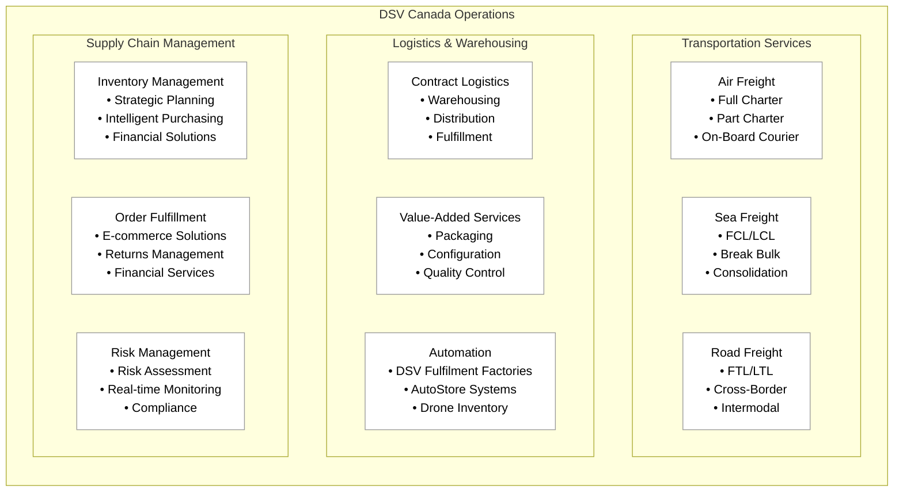
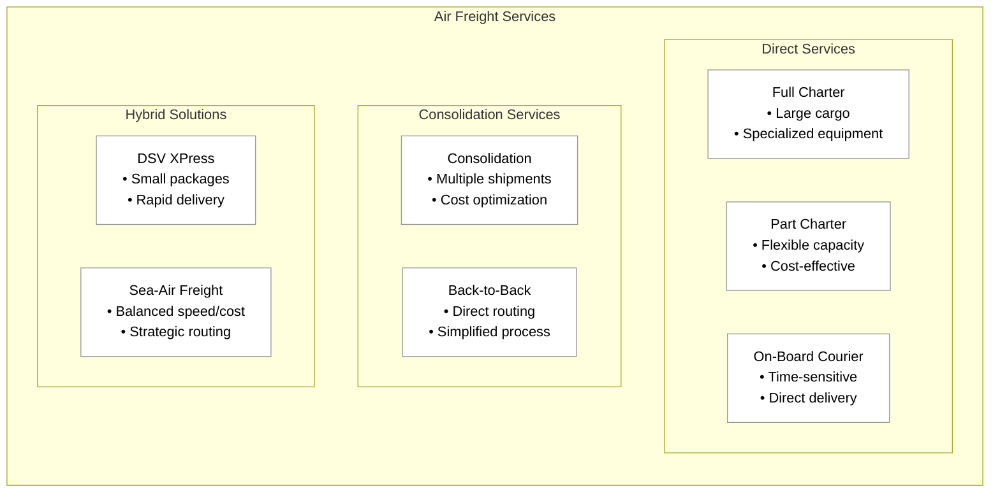
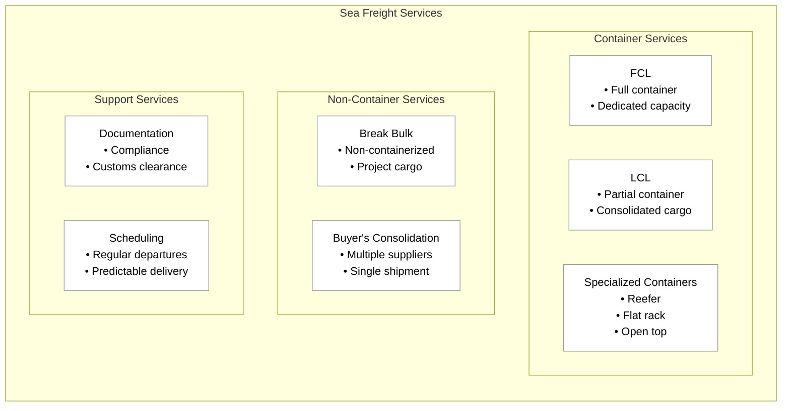
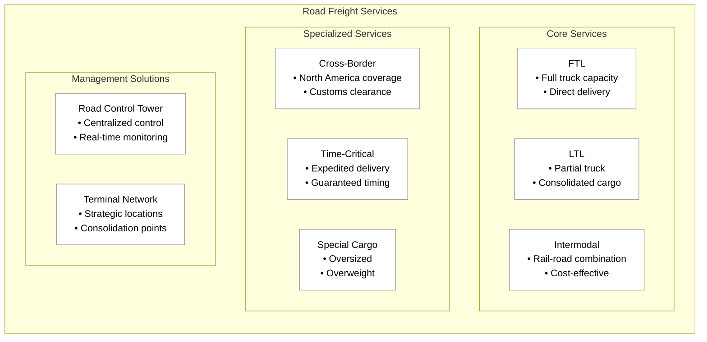
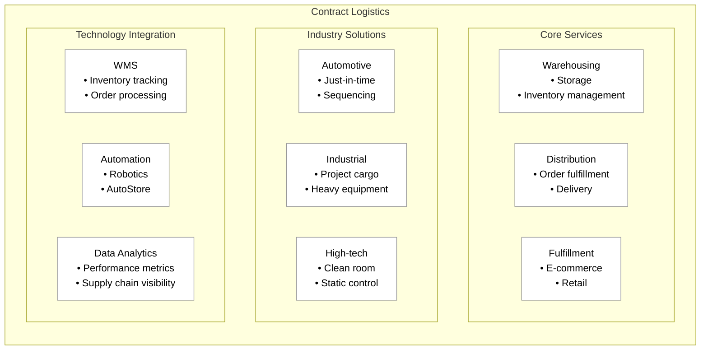
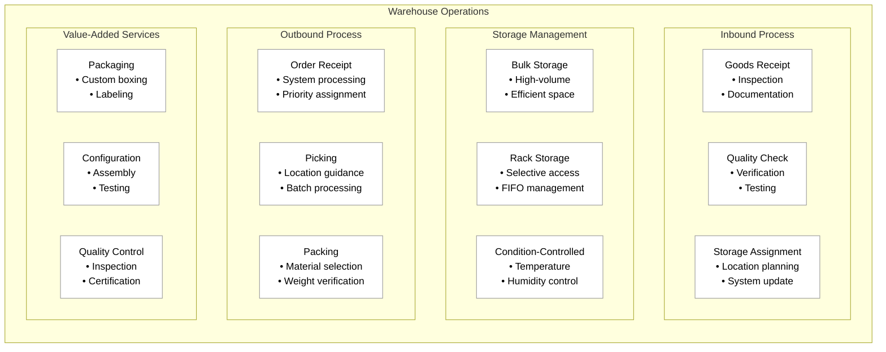
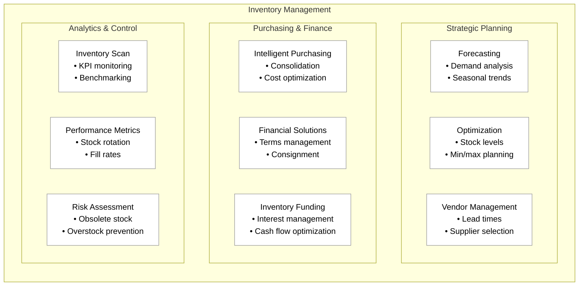
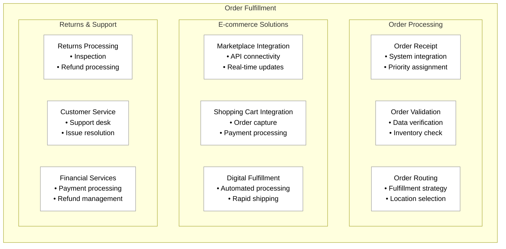
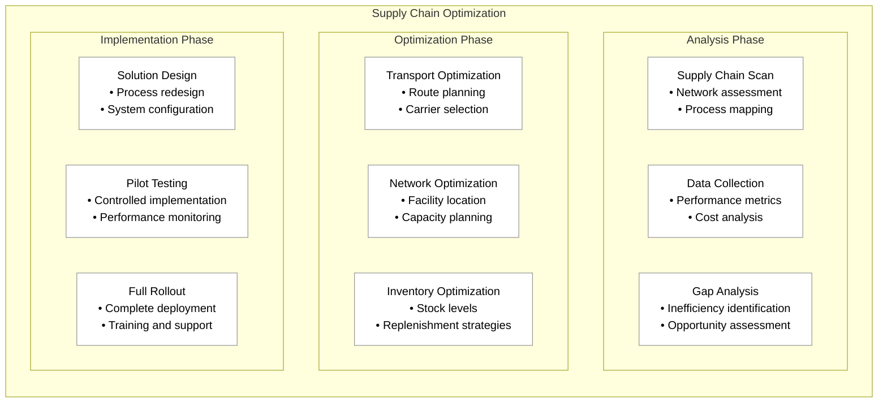
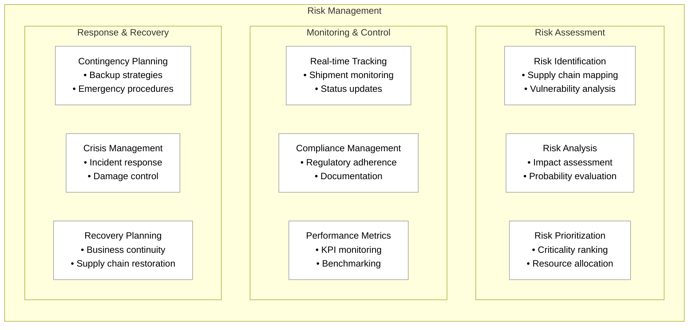

 

# DSV Canada: A Leader in Canadian Logistics

DSV Canada, formerly DB Schenker Canada, is a dominant force in the Canadian logistics landscape following the largest acquisition in logistics history. The company combines over 150 years of DB Schenker's expertise with DSV's global capabilities, creating a comprehensive logistics and supply chain management organization.

## Business Structure and Integration

The acquisition of DB Schenker by DSV in April 2025 created a global logistics powerhouse with approximately 160,000 employees across more than 90 countries. In Canada, this integration has established DSV Canada as a major player in the domestic logistics market, combining extensive local expertise with global capabilities.

## Transportation Services

### Air Freight

- Full charter services for large or specialized cargo
- Part charter options for flexible capacity
- On-board courier services for time-sensitive shipments
- Consolidation services for cost optimization
- Back-to-back services for direct shipments
- DSV XPress for smaller packages requiring rapid delivery
- Sea-air freight solutions for optimal balance of speed and cost

### Sea Freight

- Full Container Load (FCL) and Less than Container Load (LCL) services
- Non-containerized and break bulk cargo handling
- Buyer's consolidation services
- Comprehensive compliance and documentation support
- Regular sailing schedules for predictable delivery times
- Multiple container types including:
  - Dry containers
  - Reefer containers
  - Flat rack containers
  - High cube containers
  - Open top containers
  - Platform containers
  - Garment hangers containers

### Road Freight

- Full Truckload (FTL) and Less-than-Truckload (LTL) services
- Local, regional, and long-haul transportation
- Cross-border services throughout North America
- Intermodal transportation combining road with rail
- Time-critical (expedited) services
- Specialized transport solutions for oversized/overweight cargo
- Road Control Tower solution for centralized management

## Contract Logistics and Warehousing

### Contract Logistics Solutions

- Comprehensive warehousing and distribution services
- Industry-specific solutions for:
  - Automotive
  - Industrial
  - High-tech
  - Consumer products
  - Healthcare
- Customized logistics setups for each client
- Advanced technology integration
- Scalable physical and digital infrastructure

### Warehousing Processes

- Inbound processing with real-time status updates
- Storage management using CargoWrite WMS
- Outbound processing and order fulfillment
- Regular cycle counting for inventory accuracy
- Multi-site and multi-client management capabilities
- Specialized storage options including:
  - Condition-controlled storage
  - Bulk storage
  - Shelf and rack locations

## Supply Chain Management

### Inventory Management

- Comprehensive Inventory Management Services (IMS)
- Strategic planning and parts usage forecasting
- Intelligent purchasing and cost optimization
- Financial solutions including:
  - Terms management
  - Interest management
  - Consignment management
- Inventory Scan for KPI assessment and benchmarking

### Order Fulfillment

- End-to-end order fulfillment services
- E-commerce fulfillment solutions
- Marketplace and shopping cart integration
- Financial fulfillment services
- Returns management
- Customer service support

### Supply Chain Optimization

- Detailed supply chain analysis
- Transport optimization
- Network optimization
- Inventory optimization
- Data-driven insights and recommendations
- Strategic planning and implementation

### Risk Management

- Advanced risk identification and assessment
- Real-time monitoring through tracking tools
- Comprehensive contingency planning
- Compliance management services
- Supply Chain Management (SCM) Services platform
- Live cargo tracking at multiple levels

## Industry Position and Future Outlook

DSV Canada's position in the Canadian logistics market is strengthened by:

- Comprehensive service portfolio
- Alignment with key industry trends
- Commitment to innovation
- Extensive network capabilities
- Focus on operational excellence
- Customer-centric solutions

The company is well-positioned to address the evolving needs of businesses across various sectors in Canada, particularly in light of the projected 7.5% CAGR growth in the Canadian logistics market from 2025 to 2030.
